# 数据库

## 抽象

- 我们使用 Rust Stable GATs 创建了一个 [Database trait 抽象](https://github.com/paradigmxyz/reth/blob/main/crates/storage/db-api/src/database.rs)，这使我们摆脱了与单一数据库实现的绑定。我们目前使用 MDBX，但正在探索 [redb](https://github.com/cberner/redb) 作为替代方案。
- 随后，我们迭代了 [`Transaction`](https://github.com/paradigmxyz/reth/blob/main/crates/storage/db-api/src/transaction.rs)，作为一个无泄漏的抽象，并带有用于严格类型化和单元测试的高级数据库抽象的辅助工具。

## 编解码器 (Codecs)

- 我们希望 Reth 的序列化格式能够根据用户身份在读/写速度和大小之间进行权衡。
- 为了实现这一点，我们创建了 [Encode/Decode/Compress/Decompress traits](https://github.com/paradigmxyz/reth/blob/main/crates/storage/db-api/src/table.rs)，使数据库 `Table::Key` 和 `Table::Values` 的（反）序列化变得通用。
  - 这允许[开箱即用的基准测试](https://github.com/paradigmxyz/reth/blob/main/crates/storage/db/benches/criterion.rs)（使用 [Criterion](https://github.com/bheisler/criterion.rs)）。
  - 它还支持使用 [trailofbits/test-fuzz](https://github.com/trailofbits/test-fuzz) 进行[开箱即用的模糊测试](https://github.com/paradigmxyz/reth/blob/main/crates/storage/db-api/src/tables/codecs/fuzz/mod.rs)。
- 我们为以下编码格式实现了该 trait：
  - [以太坊专用的紧凑编码 (Compact Encoding)](https://github.com/paradigmxyz/reth/blob/main/crates/storage/codecs/derive/src/compact/mod.rs)：许多以太坊数据类型在序列化时具有不必要的零，或者包含可选字段（例如空哈希），如果不在存储成本中支付这些开销会更好。
    - [Erigon](https://github.com/ledgerwatch/erigon/blob/12ee33a492f5d240458822d052820d9998653a63/docs/programmers_guide/db_walkthrough.MD) 通过在 Table "PlainState" 上设置 `bitfield` 来实现这一点，从而为账户添加了位图。
    - [Akula](https://github.com/akula-bft/akula/) 手动将其扩展到其他表和数据类型。它还通过使用 [`modular_bitfield`](https://docs.rs/modular-bitfield/latest/modular_bitfield/) crate 存储某些类型（U256, u64）的长度来进一步节省空间。
    - 我们通过编写一个派生宏 (derive macro) 来自动生成实现该 trait 的代码，从而将其推广到所有类型。它还生成使用 ToB/test-fuzz 进行模糊测试所需的接口。
  - [Scale 编码](https://github.com/paritytech/parity-scale-codec)
  - [Postcard 编码](https://github.com/jamesmunns/postcard)
  - 透传 (Passthrough)（在代码库中称为 `no_codec`）
- 我们通过名为 [`reth_codec`](https://github.com/paradigmxyz/reth/blob/main/crates/storage/codecs/derive/src/lib.rs) 的派生宏简化了这些 trait 的实现，该宏委托给 Compact（默认）、Scale、Postcard 或透传编码之一。这在[我们需要的每个结构体上派生](https://github.com/search?q=repo%3Aparadigmxyz%2Freth%20%22%23%5Breth_codec%5D%22&type=code)，并让我们能够试验不同的编码格式，而无需每次都修改整个代码库。

### 表结构布局 (Table layout)

历史状态更改按 `BlockNumber` 建立索引。这意味着 `reth` 存储了每个区块触达后的每个账户状态，并提供用于快速访问该数据的索引。虽然这可能会使数据库体积变大（一旦 `reth` 接近生产环境就需要进行基准测试），但它提供了对历史状态的快速访问。

下面，你可以看到实现此方案的表设计：

```mermaid
erDiagram
CanonicalHeaders {
    u64 BlockNumber "PK"
    B256 HeaderHash "Value for CanonicalHeaders"
}
HeaderNumbers {
    B256 BlockHash "PK"
    u64 BlockNumber
}
Headers {
    u64 BlockNumber "PK"
    Header Data
}
BlockBodyIndices {
    u64 BlockNumber "PK"
    u64 first_tx_num
    u64 tx_count
}
BlockOmmers {
    u64 BlockNumber "PK"
    Header[] Ommers
}
BlockWithdrawals {
    u64 BlockNumber "PK"
    Withdrawal[] Withdrawals
}
Transactions {
    u64 TxNumber "PK"
    TransactionSigned Data
}
TransactionHashNumbers {
    B256 TxHash "PK"
    u64 TxNumber
}
TransactionBlocks {
    u64 MaxTxNumber "PK"
    u64 BlockNumber
}
Receipts {
    u64 TxNumber "PK"
    Receipt Data
}
Bytecodes {
    B256 CodeHash "PK"
    Bytes Code
}
PlainAccountState {
    Address Account "PK"
    Account Data
}
PlainStorageState {
    Address Account "PK"
    B256 StorageKey "PK"
    U256 StorageValue
}
AccountsHistory {
    B256 Account "PK"
    BlockNumberList BlockNumberList "List of transitions where account was changed"
}
StoragesHistory {
    B256 Account "PK"
    B256 StorageKey "PK"
    BlockNumberList BlockNumberList "List of transitions where account storage entry was changed"
}
AccountChangeSets {
    u64 BlockNumber "PK"
    B256 Account "PK"
    ChangeSet AccountChangeSets "Account before transition"
}
StorageChangeSets {
    u64 BlockNumber "PK"
    B256 Account "PK"
    B256 StorageKey "PK"
    ChangeSet StorageChangeSets "Storage entry before transition"
}
HashedAccounts {
    B256 HashedAddress "PK"
    Account Data
}
HashedStorages {
    B256 HashedAddress "PK"
    B256 HashedStorageKey "PK"
    U256 StorageValue
}
AccountsTrie {
    StoredNibbles Nibbles "PK"
    BranchNodeCompact Node
}
StoragesTrie {
    B256 HashedAddress "PK"
    StoredNibblesSubKey NibblesSubKey "PK"
    StorageTrieEntry Node
}
TransactionSenders {
    u64 TxNumber "PK"
    Address Sender
}
TransactionHashNumbers ||--|| Transactions : "hash -> tx id"
TransactionBlocks ||--|{ Transactions : "tx id -> block number"
BlockBodyIndices ||--o{ Transactions : "block number -> tx ids"
Headers ||--o{ AccountChangeSets : "each block has zero or more changesets"
Headers ||--o{ StorageChangeSets : "each block has zero or more changesets"
AccountsHistory }|--|{ AccountChangeSets : index
StoragesHistory }|--|{ StorageChangeSets : index
Headers ||--o| BlockOmmers : "each block has 0 or more ommers"
BlockBodyIndices ||--|| Headers : "index"
HeaderNumbers |o--|| Headers : "block hash -> block number"
CanonicalHeaders |o--|| Headers : "canonical chain block number -> block hash"
Transactions ||--|| Receipts : "each tx has a receipt"
PlainAccountState }o--o| Bytecodes : "an account can have a bytecode"
PlainAccountState ||--o{ PlainStorageState : "an account has 0 or more storage slots"
Transactions ||--|| TransactionSenders : "a tx has exactly 1 sender"

PlainAccountState ||--|| HashedAccounts : "hashed representation"
PlainStorageState ||--|| HashedStorages : "hashed representation"
```

